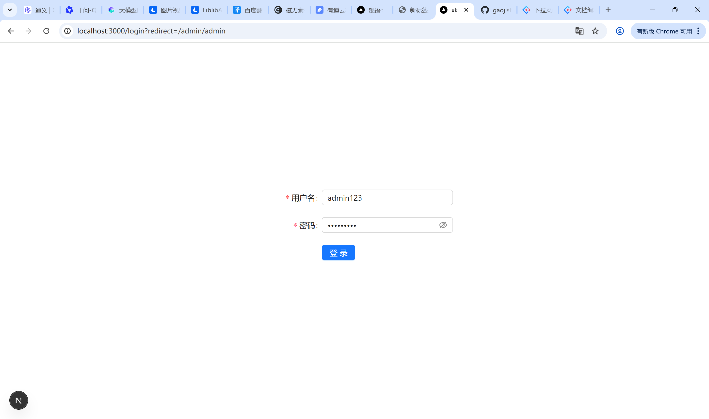
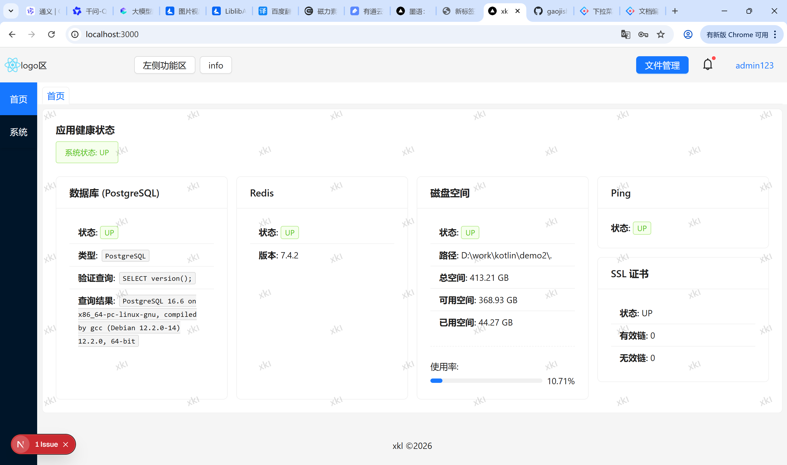
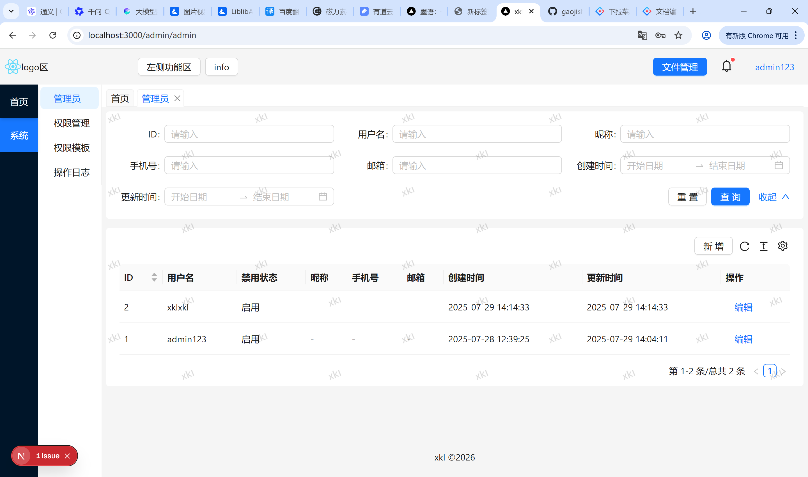
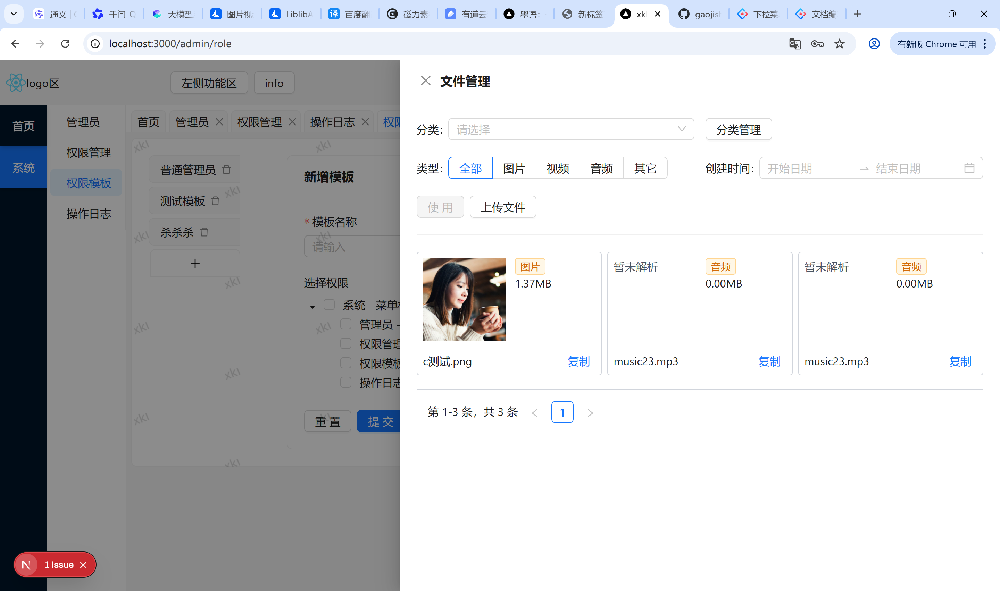

技术栈 nextjs + ant design + typescript + tailwindcss + stompjs + reduxjs + axios + nprogress + sockjs-client + dayjs 等等

中后台基础功能

1. 登录
2. 权限（菜单权限、操作权限）
3. 管理员
4. 操作日志
5. 文件管理


## 快速开始

```bash
# 安装
pnpm install

# 运行
npm run dev

```

## 页面展示




## 暂无更多文档说明，如有需求请联系作者补充QQ： 2058827620
