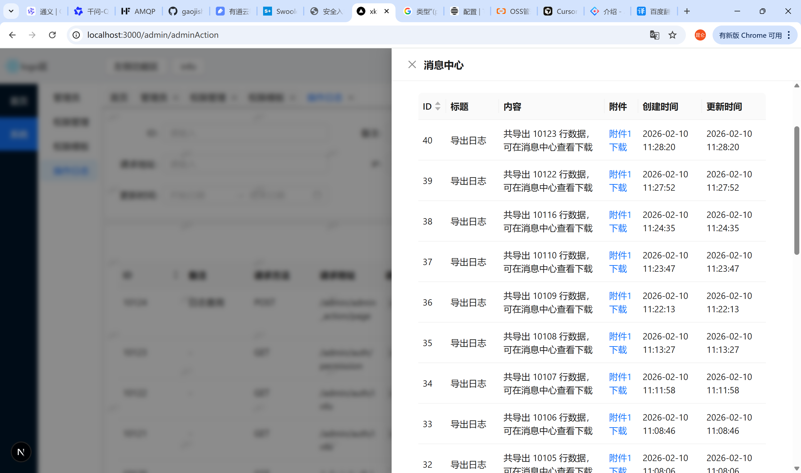

技术栈 nextjs + ant design + typescript + tailwindcss + stompjs + reduxjs + axios + nprogress + sockjs-client + dayjs + websocket 处理异步 等等

与后端配合使用：
后端仓库地址 https://github.com/gaojishu/hyperf31

中后台基础功能

1. 登录
2. 权限（菜单权限、操作权限）
3. 管理员
4. 操作日志
5. 文件管理
6. 异步任务（websocket处理异步）
7. 消息中心


## 快速开始

```bash
# 安装
pnpm install

# 运行
npm run dev

```

## 页面展示
### 登录页面，可自行改造

### 首页页面

### 管理员

### 文件管理器，oss直传，可上传所有文件，只支持图片、视频在线预览

### 消息中心，配合websocket 处理异步

## 暂无更多文档说明，如有需求请联系作者补充QQ： 2058827620
